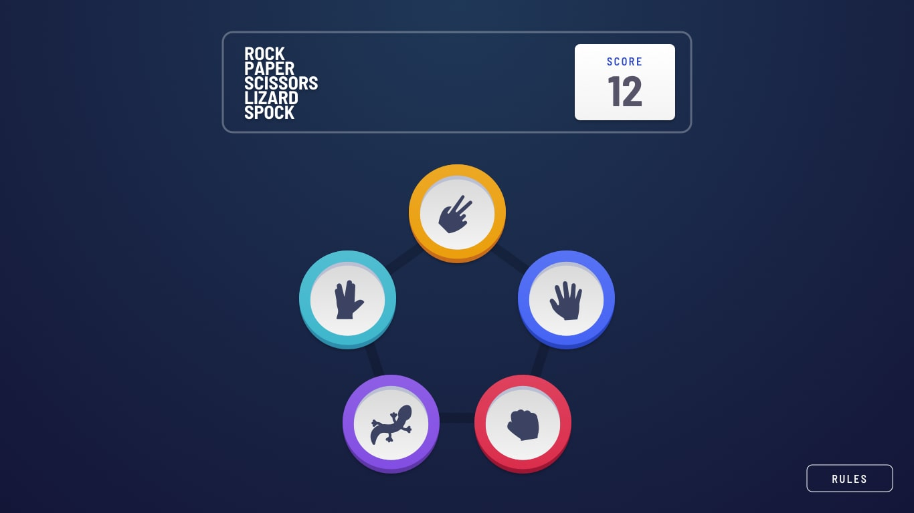

# Frontend Mentor - Rock, Paper, Scissors

<h1 align="center">
  
</h1>

## Bem-vindo! 👋

### [Veja o Site Aqui!](https://joaopedro202.github.io/rock-paper-scissors/)

---

## Sobre

Desafio do site Frontend Mentor, onde eu tive que criar o clássico jogo pedra, papel e tesoura e deixá-lo o mais próximo possível do design.

### Design 👇

---

## Bonus Game

Outra parte do desafio era criar um Bonus Game chamado Pedra, Papel, Tesoura, Lagarto e Spock

Se você não sabe do que estou falando, confira neste [vídeo](https://www.youtube.com/watch?v=OtzekNVWs30).

### Design 👇

---

## Ferramentas

- [Visual Studio Code](https://code.visualstudio.com/)
- [Frontend Mentor](https://www.frontendmentor.io/)
- HTML5
- CSS3
- JavaScript
